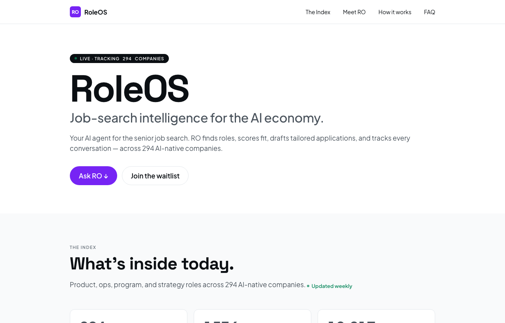

<!-- DEMO_GIF -->

<p align="center">
  <a href="https://ro.roleos.fyi"></a>
</p>

<h1 align="center">RoleOS</h1>

<p align="center"><b>RO runs your job hunt end to end, Find to Apply to Land. You keep every decision.</b></p>

<p align="center">
  <a href="https://github.com/nikjain15/roleos-app/actions/workflows/ci.yml"></a>
  
  <a href="LICENSE"></a>
  
</p>

<p align="center">
  <a href="https://ro.roleos.fyi"><b>Live at ro.roleos.fyi ↗</b></a> &nbsp;·&nbsp; source-available, this repo is the code
</p>

---

**An AI-first agent that runs your senior job hunt.** RO finds roles that fit your
trajectory, scores them honestly (pursue / maybe / skip), and co-creates tailored
applications with you, résumés, PRDs, prototypes, screening answers, interview prep,
and negotiation. Every outward action is human-gated: RO drafts, **you send**.

RoleOS is in **early access** (waitlist at [ro.roleos.fyi](https://ro.roleos.fyi)); this
README is about how it is built.

## How the AI works

- **A five-gate agent, one path per answer.** Match, screening, build studio, coach, and
  negotiation each run as skills over a single quality-gated model path (`agent/skills/run.ts`);
  the gate can send a pass back for another attempt or flag it `needs_your_eyes`.
- **Grounded matching over pgvector.** Roles are embedded (Cloudflare Workers AI `bge-base-en-v1.5`)
  and recalled from Supabase pgvector, so ranking reasons over the retrieved corpus rather than free-associating.
- **Metered multi-model routing with dynamic difficulty escalation.** A deterministic classifier
  seeds a tier on a cheapest→strongest ladder (`quick_tag` Haiku → `draft` Sonnet → `reason` Opus)
  and re-routes down for trivial inputs, up when the quality gate is unhappy; escalation is bounded
  and every hop stays metered (`agent/routing.ts`).
- **A no-send invariant.** No outbound send tool exists under `agent/`; the boundary is enforced by
  dependency-cruiser and by `tests/invariants/`, so RO can never send on your behalf.
- **Embedded Conduit client.** The primary answer path now generates through the vendored
  `@conduit/client` in `mode: "embedded"`, a stable seam that can later point at a hosted gateway
  with no call-site changes and no change to cost accounting (see [`docs/conduit.md`](docs/conduit.md)).

## Stack

- **Next.js 15 (App Router)** on **Cloudflare Workers** via `@opennextjs/cloudflare`
- **Supabase** (Postgres + pgvector + RLS + auth), magic-link, Google, LinkedIn OIDC
- **Anthropic API:** Opus (reason/critic), Sonnet (draft/code), Haiku (tag) via a metered agent registry
- **Cloudflare Workers AI** (`bge-base-en-v1.5`) for embeddings; **Cloudflare Workflows** for durable ingestion

## The five gates

1. **Match:** reason over the corpus, rank with calibrated why + gaps
2. **Screening / recruiter:** classify inbox, truth-gated answers, you-send replies
3. **Build studio:** co-create résumés, PRDs/case studies, and sandboxed prototypes with an enforced authenticity gate
4. **Coach:** mock interviews + honest debrief
5. **Negotiation:** benchmark, leverage, drafted counter (you send)

## Repository layout

| Dir | Role |
|---|---|
| `agent/` | RO's skills, tools, quality gate, model registry, Conduit seam + dynamic routing |
| `app/` | Next.js routes (onboarding, feed, studio, admin, auth) |
| `components/` | React UI |
| `lib/` | Services: embeddings, matching, ingestion, google, digest, notifications |
| `db/` | Supabase migrations (schema, RLS, auth, notifications, ingestion) |
| `ingest/` | Durable Cloudflare Workflow that hunts the role corpus |
| `cron/` | Scheduled worker (hourly digests + bounded ingest) |
| `sandbox/` | Cloudflare Sandbox SDK worker for live prototype previews |
| `seed/` | Role corpus seed + embeddings: 691 extracted postings, 689 unique after id dedup |
| `tests/` | Unit + invariant tests (incl. human-gated-outward guards) |
| `docs/` | Setup runbooks, security audit, architecture handoff |
| `archive/` | Parked role snapshots from the manual→automated ingestion migration |

## Quickstart

Node 20+ (CI runs 22). Clone, then:

```bash
npm ci
npm run check          # typecheck · lint · import invariant · 503 tests (no secrets needed)
npm run eval:retrieval:live   # scores the real role corpus offline (no DB, no model)
cp .dev.vars.example .dev.vars   # fill in Supabase + Anthropic + Cloudflare,
                                 # then mirror the NEXT_PUBLIC_* pair into .env.local
npm run dev            # http://localhost:3000
```

`npm run check` and the offline evals run on a bare clone. The app itself needs the
secrets above, [`SETUP.md`](SETUP.md) is the full path (Supabase project, Workers AI
binding, Google OAuth), and [`docs/setup-deploy.md`](docs/setup-deploy.md) covers the
Cloudflare deploy. Deploys are automatic on merge to `main` and only run behind a
green CI workflow (`.github/workflows/deploy.yml`).

**Status, honestly.** RoleOS is early access, and three things in this repo are
scaffolding rather than finished surface, called out here so nobody has to find them
the hard way: the single outbound route `app/api/dispatch` **returns 501** (the
contract exists, no live transport, which is what makes "RO drafts, you send"
structural); the three read tools are live-backed but the remaining agent tool `run`
implementations in `agent/tools/index.ts` are **Phase-1 placeholders** returning
`{ todo: "phase 2" }`; and the deterministic **PII / privacy scan inside the quality
gate is a stub** (the no-send scan, the voice blocklist, and the LLM truth gate are
real and fail closed). Full accounting in [`docs/PRD.md`](docs/PRD.md).

## Getting started

- **First build / deploy:** [`SETUP.md`](SETUP.md) then [`docs/setup-deploy.md`](docs/setup-deploy.md)
- **Design source-of-truth (visual):** [`docs/specs/design-system.md`](docs/specs/design-system.md), the tokens, type, and components every screen is built on. Live style guide at `/design`.
- **Design source-of-truth (product/arch):** `../roleos-design/architecture.md`

### Docs index

| Doc | Purpose |
|---|---|
| `docs/setup-deploy.md` | Cloudflare deploy runbook (secrets, custom domain, Supabase auth) |
| `docs/setup-google.md` | Google OAuth + Gmail/Calendar scopes |
| `docs/setup-scraper.md` | Optional LinkedIn URL→profile fetch (Apify/Bright Data) |
| `docs/setup-sandbox.md` | Live prototype previews (Docker + CF Containers) |
| `docs/setup-role-refresh.md` | Recurring corpus-freshness loop (plan) |
| `docs/admin-ingestion.md` | Admin-driven ingestion pipeline (finalized) |
| `docs/explore-index.md` | Public browsable role index (spec) |
| `docs/security-audit.md` | Phase-5 RLS + secrets audit (green) |
| `docs/specs/design-system.md` | **Visual design system:** tokens, type, components (the contract for every screen) |

## Docs

Technical-PM / FDE documentation for this repo (grounded in the actual code):

| Doc | What's inside |
|---|---|
| [`docs/PRD.md`](docs/PRD.md) | Personas, jobs-to-be-done (the five gates), success metrics, tradeoffs, Now/Next/Later roadmap |
| [`docs/ARCHITECTURE.md`](docs/ARCHITECTURE.md) | System overview + component and matching-flow Mermaid diagrams; the metered multi-model registry, pgvector matching, quality gate, and the human-gated-outward invariant |
| [`docs/EVALS.md`](docs/EVALS.md) | Eval ladder (unit → LLM-judge → offline model evals → A/B); named metrics; what's implemented vs roadmap |
| [`docs/TECHNICAL_NOTES.md`](docs/TECHNICAL_NOTES.md) | 12-point Technical-AI-PM / FDE scorecard with file-level evidence, model/orchestration details, guardrails, cost |
| [`docs/FDE_JOURNEY.md`](docs/FDE_JOURNEY.md) | Deploying into a real environment: integration, secrets/security, rollout/cutover, observability, de-risking |
| [`docs/conduit.md`](docs/conduit.md) | The embedded `@conduit/client` seam on the primary answer path, dynamic difficulty routing, and env-gated live-usage reporting to a Conduit gateway |
| [`docs/MCP.md`](docs/MCP.md) | Read-only MCP server (`search_roles`) over the public role corpus: stdio today, HTTP/SSE URL shape documented (not yet mounted) |
| [`evals/`](evals/) | Self-contained offline eval harness (retrieval precision/recall/F1/MRR), `npx tsx evals/retrieval/run.ts` |

## Non-negotiables

- **Human-gated outward:** no send tool exists in the agent; enforced by `tests/invariants/`.
- **Quality over latency:** never trade output quality for speed; optimize speed separately.
- **Truth-gated:** drafted claims must trace to your real profile or they're flagged for your eyes.
- **One design system:** every screen is built on [`docs/specs/design-system.md`](docs/specs/design-system.md) (grape accent · cool neutrals · Space Grotesk + Plus Jakarta Sans · two faces). No warm-paper, no Inter, no ad-hoc palettes. Each Phase-J slice rebuilds its screen fully on it.
