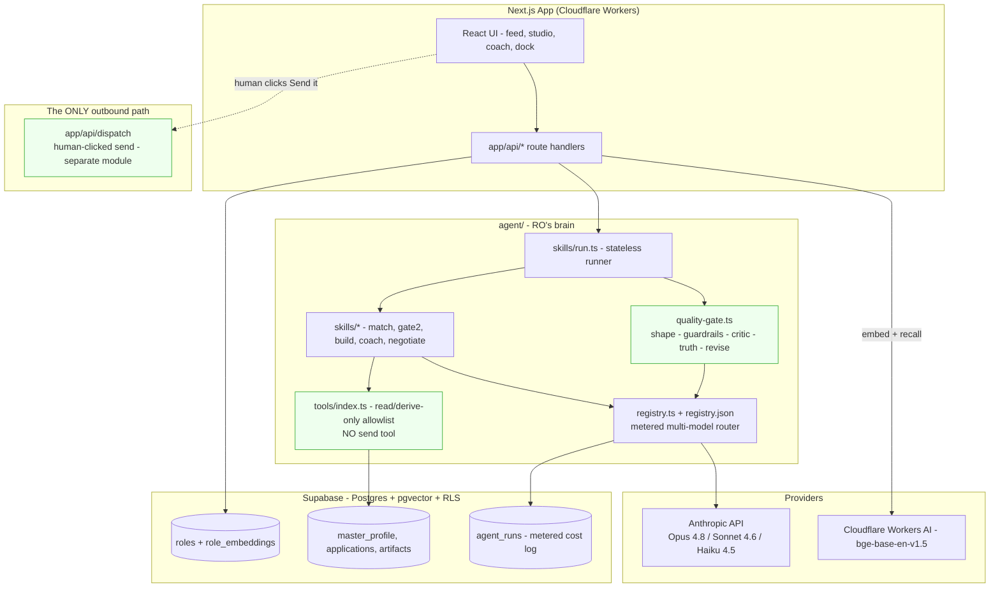
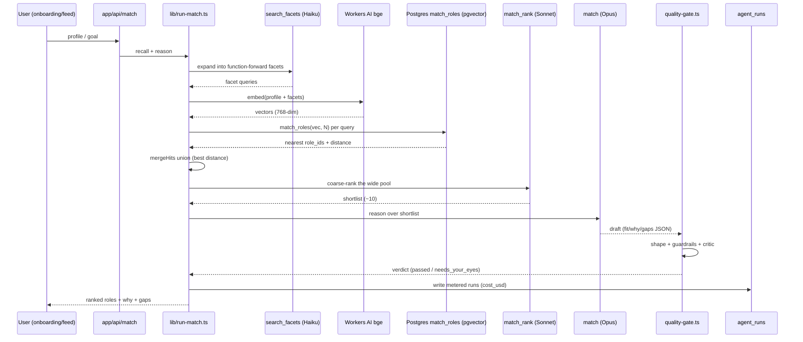

# RoleOS - Architecture

> How RO is built, grounded in actual code paths. Two diagrams below: a component view and a request/data-flow sequence for the matching gate.

## 1. Stack (verified in `package.json`, `wrangler.jsonc`, `db/`)

- **Frontend / app:** Next.js 15 (App Router), React 19, TypeScript, Tailwind. Deployed on **Cloudflare Workers** via `@opennextjs/cloudflare`.
- **Data:** Supabase - Postgres + **pgvector** + row-level security + auth (magic-link, Google, LinkedIn OIDC). Migrations in `db/migrations/`.
- **Models:** Anthropic API (`@anthropic-ai/sdk`) - Opus 4.8, Sonnet 4.6, Haiku 4.5 - plus **Cloudflare Workers AI** `@cf/baai/bge-base-en-v1.5` for embeddings (768-dim).
- **Durable / background:** Cloudflare Workflows for ingestion (`ingest/`), a scheduled Worker (`cron/`), and a Cloudflare Sandbox SDK worker for live prototype previews (`sandbox/`).
- **Quality bar:** `npm run check` = typecheck + lint + `invariant:imports` (dependency-cruiser) + vitest. Playwright for E2E, including a live harness (`playwright.live.config.ts`).

## 2. The core idea: skills + one call path + one gate

An "agent" in RO is not a framework object. A **skill** is a small declarative file (`agent/skills/skill.ts`) naming: which registry **job** (model), which tools, a grounded prompt builder, and which gate. The stateless runner (`agent/skills/run.ts`) executes it through **one** model call path (`agent/registry.ts::callModel`) and **one** quality gate (`agent/quality-gate.ts`) before any output reaches the user. Adding or changing an agent is a one-file change.

Note that `agent/**` never touches `app/api/dispatch` - that edge is a human gesture only, and the disallowed import is enforced by CI (see §6).

## 3. The metered multi-model registry (`agent/registry.json`, `agent/registry.ts`)

Routing is **real and config-driven**. Each *job* names a provider, model, and params; a skill names a job, not a hard-coded model. `callModel(job, call)` resolves the job, calls the raw Anthropic SDK, and returns text plus a cost record the caller persists to `agent_runs`. Cost tracking is in the call path, not optional.

| Job | Model | Used for | Cost /Mtok (in/out) |
|---|---|---|---|
| `reason` | `claude-opus-4-8` | Match, negotiation, adversarial grading | 5.0 / 25.0 |
| `draft` | `claude-sonnet-4-6` | Résumé, cover, screening answers, replies | 3.0 / 15.0 |
| `code` | `claude-sonnet-4-6` (16k out, no thinking) | Gate-3 prototype canvas | 3.0 / 15.0 |
| `quick_tag` | `claude-haiku-4-5` | Recruiter classification, light tags | 1.0 / 5.0 |
| `critic` | `claude-opus-4-8` | The LLM-judge quality gate (judge ≥ drafter) | 5.0 / 25.0 |
| `embed` | `@cf/baai/bge-base-en-v1.5` (768-dim) | Corpus + query embeddings | 0.012 / 0 |

Two implementation details worth flagging (both encoded in code + tests): Opus 4.8 / Sonnet 4.6 reject `temperature`/`top_p`/`budget_tokens` (they 400), so depth is steered with `output_config.effort` + adaptive thinking; Haiku takes no effort param. `tests/unit/registry.test.ts` asserts the model-per-job mapping and that no temperature is ever sent.

## 4. Retrieval / grounded matching (`lib/match.ts`, `lib/run-match.ts`)

Matching is a three-stage pipeline built to beat domain bias, not a single similarity score:

1. **Facet expansion** (`agent/skills/search_facets`, Haiku): turn the raw profile into function-forward queries so recall is not trapped in the candidate's current-industry vocabulary.
2. **Multi-query pgvector recall** (`recallRolesMulti`): embed every query with the same `bge` vector space as the corpus, run the `match_roles` cosine-distance RPC per query, and **union** the neighbours keeping each role's best distance (`mergeHits`, pure and unit-tested). Wide, diverse pool.
3. **Rerank then reason** (`match_rank` Sonnet → `match` Opus): a cheap pass scores the whole pool; only the genuine top ~10 go to the token-bounded reasoner, which writes `fit`, `pursue/maybe/skip`, `why`, and bridgeable `gaps`, calibrated to a confidence ladder.

Query and corpus embeddings **must** share one provider or cosine distance is meaningless - enforced by construction in `lib/embeddings/index.ts` (one provider, one vector space, dev and prod).

## 5. The quality gate (`agent/quality-gate.ts`)

Nothing reaches the user raw. Cheap deterministic checks first, the expensive smart check last:

1. **Shape check** - output is structurally right (`skill.expects`).
2. **Guardrails** - deterministic, network-free: a no-send output-marker scan (RO never claims to have sent anything) and a voice blocklist (hype, guilt, manufactured urgency, emoji-spam). Exported as `inspectGuardrails` for tests.
3. **Critic (LLM-judge)** - a *separate* Opus call grading the draft against the ro-voice ship checklist.
4. **Truth gate** - for résumé-class outputs, a separate Opus call that flags any claim not traceable to the master profile; it **fails closed** (unparseable judge = not a pass).
5. **Revise loop** - auto-fix once and re-judge; structured JSON gets a truth-driven re-ground instead of a prose revise (prose revise corrupts JSON). Still failing → surfaced honestly as `needs_your_eyes`, never silently shipped.

Every verdict returns the metered model runs so the caller writes cost to `agent_runs`.

## 6. The human-gated-outward invariant (three independent layers)

This is the architectural heart, and it is defended three ways so no single change can break it:

- **Layer 1 - no send tool exists.** `agent/tools/index.ts` exposes a fixed allowlist of six read/derive-only tools. `tests/invariants/no-send-tool.test.ts` asserts no tool name or description matches `send|email|dispatch|http|fetch|post|submit|sms|webhook`.
- **Layer 2 - one outbound module.** `app/api/dispatch/route.ts` is the only route that may ever perform an external send; it is a different module the agent layer cannot import, and today it returns 501 (contract without a live transport).
- **Layer 3 - CI-enforced import ban.** `.dependency-cruiser.cjs` fails the build if anything under `agent/**` imports an outbound transport (`nodemailer`, `resend`, `@sendgrid`, `twilio`, `node:http`, `lib/email`, …) or the dispatch route. Run via `npm run invariant:imports`.

## 7. Safety & data integrity guards (in code)

- **RLS coverage invariant** (`tests/invariants/rls-coverage.test.ts`): every user-owned migration table must enable row-level security, or the build fails.
- **No client-side secret imports** (`tests/invariants/no-client-secret-imports.test.ts`).
- **Wellbeing invariant** (`tests/invariants/wellbeing.test.ts`): engagement-bait notification kinds resolve to "never" under any context.
- **Cost budget** (`lib/cost-budget.ts`): rolling 24h `agent_runs` spend vs. a daily budget, structured warn/exceeded alerts (default $25/day).
- **Security headers** + rate limiting (`lib/security-headers.ts`, `lib/rate-limit.ts`, with unit + live E2E coverage).

## 8. Testing surfaces

- Unit / invariant / stress: 51 unit files, 4 invariant files, 1 stress harness (>320 `it/test` cases).
- Live E2E: `tests/e2e/live/` (>100 test cases), including a real prompt-injection-through-a-CV test, cross-user RLS probe, a11y sweep, and a production smoke spec against `ro.roleos.fyi`.
- The build process audit matrix (`docs/AUDIT-DIMENSIONS.md`) defines 10 dimensions each slice must pass before its PR opens.

---

*Every path, model ID, and invariant above was read from the repository (`agent/`, `lib/`, `db/`, `tests/`, `.dependency-cruiser.cjs`).*
