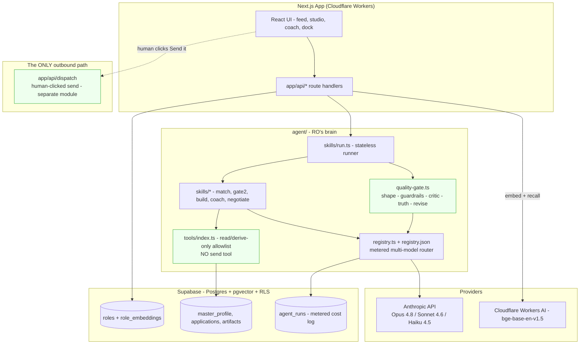
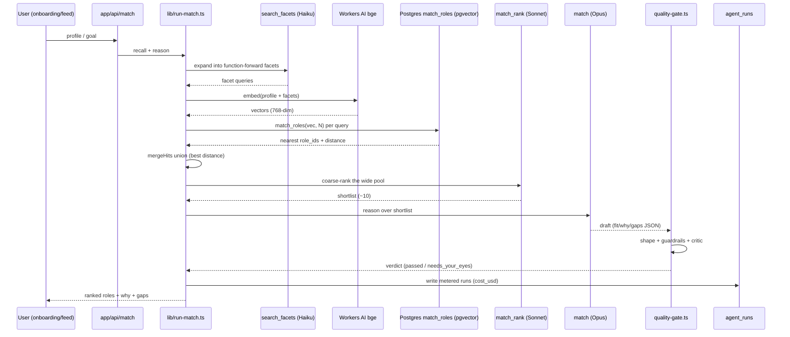

# RoleOS, Architecture

> How RO is built, grounded in actual code paths. Two diagrams below: a component view and a request/data-flow sequence for the matching gate.

## 1. Stack (verified in `package.json`, `wrangler.jsonc`, `db/`)

- **Frontend / app:** Next.js 15 (App Router), React 19, TypeScript, Tailwind. Deployed on **Cloudflare Workers** via `@opennextjs/cloudflare`.
- **Data:** Supabase, Postgres + **pgvector** + row-level security + auth (magic-link, Google, LinkedIn OIDC). Migrations in `db/migrations/`.
- **Models:** Anthropic API (`@anthropic-ai/sdk`), Opus 4.8, Sonnet 4.6, Haiku 4.5, plus **Cloudflare Workers AI** `@cf/baai/bge-base-en-v1.5` for embeddings (768-dim).
- **Durable / background:** Cloudflare Workflows for ingestion (`ingest/`), a scheduled Worker (`cron/`), and a Cloudflare Sandbox SDK worker for live prototype previews (`sandbox/`).
- **Quality bar:** `npm run check` = typecheck + lint + `invariant:imports` (dependency-cruiser) + vitest. Playwright for E2E, including a live harness (`playwright.live.config.ts`).

## 2. The core idea: skills + one call path + one gate

An "agent" in RO is not a framework object. A **skill** is a small declarative file (`agent/skills/skill.ts`) naming: which registry **job** (model), which tools, a grounded prompt builder, and which gate. The stateless runner (`agent/skills/run.ts`) executes it through **one** model call path (`agent/registry.ts::callModel`, now driven through an embedded Conduit seam, §6, and steered by dynamic difficulty routing, §7) and **one** quality gate (`agent/quality-gate.ts`, §5) before any output reaches the user. Adding or changing an agent is a one-file change.



Note that `agent/**` never touches `app/api/dispatch`, that edge is a human gesture only, and the disallowed import is enforced by CI (see §9).

## 3. The metered multi-model registry (`agent/registry.json`, `agent/registry.ts`)

Routing is **real and config-driven**. Each *job* names a provider, model, and params; a skill names a job, not a hard-coded model. `callModel(job, call)` resolves the job, calls the raw Anthropic SDK, and returns text plus a cost record the caller persists to `agent_runs`. Cost tracking is in the call path, not optional.

| Job | Model | Used for | Cost /Mtok (in/out) |
|---|---|---|---|
| `reason` | `claude-opus-4-8` | Match, negotiation, adversarial grading | 5.0 / 25.0 |
| `draft` | `claude-sonnet-4-6` | Résumé, cover, screening answers, replies | 3.0 / 15.0 |
| `code` | `claude-sonnet-4-6` (16k out, no thinking) | Gate-3 prototype canvas | 3.0 / 15.0 |
| `quick_tag` | `claude-haiku-4-5` | Recruiter classification, light tags | 1.0 / 5.0 |
| `critic` | `claude-opus-4-8` | The LLM-judge quality gate (judge ≥ drafter) | 5.0 / 25.0 |
| `embed` | `@cf/baai/bge-base-en-v1.5` (768-dim) | Corpus + query embeddings | 0.012 / 0 |

Two implementation details worth flagging (both encoded in code + tests): Opus 4.8 / Sonnet 4.6 reject `temperature`/`top_p`/`budget_tokens` (they 400), so depth is steered with `output_config.effort` + adaptive thinking; Haiku takes no effort param. `tests/unit/registry.test.ts` asserts the model-per-job mapping and that no temperature is ever sent.

## 3.1 Provider resilience (`agent/retry.ts`)

Because there is exactly one call path, retry is added exactly once and every skill, every gate call and every tool-loop turn inherits it. The ladder sits **in front of** the quality gate; it does not replace it.

**What is retried.** Only genuinely transient conditions: HTTP `429`, `500`, `502`, `503`, `504`, `529`, plus network failures and our own per-attempt aborts. Everything else fails fast, and `400`/`401` are refused explicitly. That matters here: the models RoleOS uses 400 on the wrong sampling params (see §3), so a `400` means *we* built a bad request. Retrying it would burn three round-trips and then report an outage for our own bug, so it is surfaced immediately and loudly.

**What bounds the waiting.** Three separate limits, because any one alone leaks:

| Bound | Why it exists |
|---|---|
| Attempt cap (2 to 3, per tier) | A provider that is really down should be reported, not hammered. |
| Per-attempt timeout via `AbortSignal` | A hung socket must not become an infinite request. The runner races the call against its own abort, so a transport that ignores the signal cannot hang us either. |
| Whole-call deadline | The tool loop makes up to `MAX_TOOL_TURNS` (6) provider calls, so a per-turn bound compounds six-fold. The deadline is shared across every turn, retry and backoff wait of one `callModel` invocation. |

Backoff is exponential with **full jitter** (a uniformly random slice of the current window), so isolates retrying after a load-shed event do not resynchronise into a second herd. A server `Retry-After` wins over our own backoff but is capped at 20s: a provider may honestly say "come back in an hour", and parking a user behind a spinner for an hour is not an answer. A backoff that would not fit inside the remaining deadline is refused rather than slept through.

**Budgets are per tier**, because the tiers differ in what a healthy call costs and how expensive a wasted attempt is:

| Job | Attempts | Per attempt | Whole call |
|---|---|---|---|
| `quick_tag` (Haiku, 1k out) | 3 | 20s | 60s |
| `draft` (Sonnet, 8k out) | 3 | 90s | 240s |
| `code` (Sonnet, 16k out) | 2 | 180s | 300s |
| `reason` (Opus + thinking) | 3 | 120s | 300s |
| `critic` (Opus, 1.5k out) | 3 | 60s | 180s |

`quick_tag` runs on interactive paths where a healthy call is about a second, so it retries fast and cheap. `code` gets the widest window and the fewest retries: it is the longest single generation and the most expensive to throw away twice.

**The SDK's own `maxRetries` is set explicitly to `0`.** The Anthropic SDK retries by default; left alone it would multiply against our ladder (3 x 3 = 9 round-trips for one turn) while ignoring our budgets and deadline. One retry layer, deliberately chosen rather than silently inherited.

**Retry and the spend budget.** Retry made an existing accounting hole worth fixing. `callModel` accumulates tokens across tool-loop turns and only built an `AgentRunRecord` on the success return, so a failure on turn 4 of 6 discarded the counters for turns 1 to 3 that the provider had already billed: no `agent_runs` row, and the rolling-24h guard in `lib/cost-budget.ts` never saw the spend. Now the partial record travels out on a typed `MeteredProviderError`, the gate does the same with `MeteredRunsError` for calls it had already paid for, and `runSkill` writes them to `agent_runs` before rethrowing. Failed work counts against the daily budget. (A failed *attempt* contributes zero tokens because an error response carries no usage block; that is honest, and asserted rather than guessed.)

**What the user sees.** Nothing changes for a transient blip: it is absorbed and the answer arrives. When the ladder is genuinely exhausted, RO still does not invent an answer. The failure travels up as a typed error naming what happened and how many attempts were made, the surface reports honestly, and the spend is recorded. The honest-failure guarantee is unchanged; retry only removes the failures that were never real.

Covered by `tests/unit/provider-retry.test.ts` and `tests/unit/skill-run-resilience.test.ts` (injected clock, no real timers).

## 4. Retrieval / grounded matching (`lib/match.ts`, `lib/run-match.ts`)

Matching is a three-stage pipeline built to beat domain bias, not a single similarity score:

1. **Facet expansion** (`agent/skills/search_facets`, Haiku): turn the raw profile into function-forward queries so recall is not trapped in the candidate's current-industry vocabulary.
2. **Multi-query pgvector recall** (`recallRolesMulti`): embed every query with the same `bge` vector space as the corpus, run the `match_roles` cosine-distance RPC per query, and **union** the neighbours keeping each role's best distance (`mergeHits`, pure and unit-tested). Wide, diverse pool.
3. **Rerank then reason** (`match_rank` Sonnet → `match` Opus): a cheap pass scores the whole pool; only the genuine top ~10 go to the token-bounded reasoner, which writes `fit`, `pursue/maybe/skip`, `why`, and bridgeable `gaps`, calibrated to a confidence ladder.

Query and corpus embeddings **must** share one provider or cosine distance is meaningless, enforced by construction in `lib/embeddings/index.ts` (one provider, one vector space, dev and prod).



## 5. The quality gate (`agent/quality-gate.ts`)

Nothing reaches the user raw. Cheap deterministic checks first, the expensive smart check last:

1. **Shape check:** output is structurally right (`skill.expects`).
2. **Guardrails:** deterministic, network-free: a no-send output-marker scan (RO never claims to have sent anything) and a voice blocklist (hype, guilt, manufactured urgency, emoji-spam). Exported as `inspectGuardrails` for tests.
3. **Critic (LLM-judge):** a *separate* Opus call grading the draft against the ro-voice ship checklist.
4. **Truth gate:** for résumé-class outputs, a separate Opus call that flags any claim not traceable to the master profile; it **fails closed** (unparseable judge = not a pass).
5. **Revise loop:** auto-fix once and re-judge; structured JSON gets a truth-driven re-ground instead of a prose revise (prose revise corrupts JSON). Still failing → surfaced honestly as `needs_your_eyes`, never silently shipped.

Every verdict returns the metered model runs so the caller writes cost to `agent_runs`.

## 6. The Conduit seam (`agent/conduit.ts`, `lib/conduit/`)

The primary answer path does not call the model directly, it routes through an embedded `@conduit/client` seam. `@conduit/client` presents one method surface whether the core runs in-process (`mode: "embedded"`) or behind an HTTP gateway (`mode: "gateway"`); RoleOS runs it embedded, injecting its own core so nothing goes over a network hop and cost accounting is unchanged.

- `agent/skills/run.ts:runSkill` (the one path every user-facing skill answer takes) generates through `inferViaConduit` → `createClient({ mode: "embedded" })` → `client.infer` → the injected core's `resolve`, which wraps `agent/registry.ts:callModel`. The metered `ModelResult` (cost, tokens, latency, tool trace) is threaded straight back, so metering and the quality gate are untouched.
- The core's `retrieve` wraps `lib/match.ts:recallRolesMulti`, exposing read-only role recall over the global/public corpus as Conduit's unified `retrieve`.
- Only the primary generation call is switched. The secondary shape-repair reformat stays a direct `callModel`, and the quality gate is unchanged.

```
app route → runSkill → inferViaConduit → @conduit/client.infer (embedded)
          → RoleOS core.resolve → callModel → Anthropic
```

**Env-gated live-usage reporting** (`lib/conduit/reporter.ts`): when `CONDUIT_GATEWAY_URL` and `CONDUIT_GATEWAY_TOKEN` are set, each metered decision is mirrored to the Conduit gateway (`POST /v1/decisions`) for live usage/cost visibility. It is a fire-and-forget, pre-caught tap with a short timeout: it never blocks or fails the answer, only reads the record that already ran, and is a NO-OP when the env vars are unset. It lives under `lib/` (not `agent/`) on purpose, so the agent layer's outbound-transport import ban (§9) still holds; the caller in `agent/conduit.ts` imports only the pure function.

The seam also carries a `pinModel` hop used by dynamic routing (§7), and RoleOS's read-only MCP surface (`docs/MCP.md`) is built on the vendored `@conduit/mcp` package. See `docs/conduit.md` for the full write-up.

## 7. Dynamic difficulty routing (`agent/routing.ts`)

Static task→tier routing (§3) picks one model per task and never moves. Dynamic routing adds a runtime signal on top so an answer can route **down** (a cheap fast path for trivially simple inputs) or **up** (escalate to a stronger tier). The escalation ladder is cheapest→strongest and stays config-driven, each rung naming a registry job whose model defines the tier:

```
quick_tag = Haiku (cheap)  →  draft = Sonnet  →  reason = Opus (strong)
```

- **Deterministic difficulty classifier** (`classifyDifficulty`): heuristic and network-free, it reads the prompt text (length, question count, hard-work markers) and returns `trivial | normal | hard`. It only seeds the *starting* tier; it never relaxes the gate.
- **Route down:** a `trivial`, non-structured input on an eligible skill starts one rung cheaper.
- **Route up:** after the gate runs, the answer escalates when the verdict is `needs_your_eyes` (failed critic or fail-closed truth gate) **or** it passed but the gate graded it `weak` confidence (§8). The gate stays the authoritative signal: a cheap fast path that underperforms is caught and escalated straight back up.
- **Bounded and metered:** escalation is capped by `MAX_ESCALATIONS` (the ladder height) and the ladder top, so it can never loop; every hop is a metered `agent_runs` row. Each re-route is expressed as a Conduit `pinModel` (§6), so it travels the same unified seam as any other call.
- **Scope:** dynamic routing applies to the primary answer path only, full-gate skills assigned to `draft` or `reason`. Off-ladder tiers (`code`, `quick_tag`) and shape-only skills keep their static routing untouched.
- **Sampling contract preserved:** no temperature/top_p is ever sent to the reasoning tiers (they reject it); pinning changes the tier and token budget, not the sampling params.

## 8. Computed confidence & routing observability (`agent/quality-gate.ts`, `agent/skills/run.ts`)

**Computed confidence** (`computeConfidence`): the gate derives a confidence band deterministically from the signals it already computed, rather than a hard-coded label. It builds a 0..1 score and maps it to a band:

- **unknown** (fail-closed floor): a hard gate did not pass (shape, guardrails, critic, or truth), so the output cannot be vouched for.
- **weak:** the hard gates passed but a soft concern remains (the first draft needed a revise, the grounding slice was thin, or a judge noted residual caveats). This band is what drives the route-up escalation in §7.
- **strong:** a clean pass on every signal.

**Routing trace** (`RoutingTrace`: `difficulty`, `tiers`, `rerouted`, `confidence`) records how each answer was routed and is persisted into the `agent_runs.trace` jsonb by `lib/agent-runs.ts:logAgentRuns`.

Two honest limitations:

- The trace is persisted only on the **background / batch paths** that pass it (`lib/hunt.ts`, `lib/digest.ts`, `lib/taste.ts`, `lib/taste-rerank.ts`, `lib/weekly-review.ts`, `lib/ingest/`). The interactive `app/api/*` routes compute the routing trace but log `verdict.runs` **without** it today, so it is not yet surfaced on the interactive routes.
- Inside the deterministic guardrails, the **PII / privacy scan is now real** (`lib/privacy-scan.ts`), replacing the stub that used to sit here. It classifies each hit against the ground-truth profile: the candidate's own contact details pass, third-party personal data fails the guardrails, and payment cards, national identifiers and bank accounts fail regardless of the ground truth. Where there is no ground truth to classify against it returns `indeterminate`, which does not fail the gate but is never counted as a satisfied control, and `computeConfidence` caps such a run below `strong`. The no-send output-marker scan and voice blocklist are real, and the **LLM truth gate is real and fails closed**.
- **Input-side injection defence** (`lib/untrusted.ts`) wraps candidate-supplied document text in a delimited, labelled untrusted-data envelope with an unguessable boundary id, strips invisible-character smuggling, defangs boundary-shaped tokens, and screens for known injection shapes. It is applied centrally in `agent/skills/run.ts` (so a new skill is covered the day it is written) and in the quality gate's truth judge. It is a containment and labelling control, not a filter: it does not delete the payload, and the downstream fail-closed defences remain the ones that decide.

## 9. The human-gated-outward invariant (three independent layers)

This is the architectural heart, and it is defended three ways so no single change can break it:

- **Layer 1, no send tool exists.** `agent/tools/index.ts` exposes a fixed allowlist of six read/derive-only tools. `tests/invariants/no-send-tool.test.ts` asserts no tool name or description matches `send|email|dispatch|http|fetch|post|submit|sms|webhook`.
- **Layer 2, one outbound module.** `app/api/dispatch/route.ts` is the only route that may ever perform an external send; it is a different module the agent layer cannot import, and today it returns 501 (contract without a live transport).
- **Layer 3, CI-enforced import ban.** `.dependency-cruiser.cjs` fails the build if anything under `agent/**` imports an outbound transport (`nodemailer`, `resend`, `@sendgrid`, `twilio`, `node:http`, `lib/email`, …) or the dispatch route. Run via `npm run invariant:imports`.

## 10. Safety & data integrity guards (in code)

- **RLS coverage invariant** (`tests/invariants/rls-coverage.test.ts`): every user-owned migration table must enable row-level security, or the build fails.
- **No client-side secret imports** (`tests/invariants/no-client-secret-imports.test.ts`).
- **Wellbeing invariant** (`tests/invariants/wellbeing.test.ts`): engagement-bait notification kinds resolve to "never" under any context.
- **Cost budget** (`lib/cost-budget.ts`): rolling 24h `agent_runs` spend vs. a daily budget, structured warn/exceeded alerts (default $25/day).
- **Security headers** + rate limiting (`lib/security-headers.ts`, `lib/rate-limit.ts`, with unit + live E2E coverage).

## 11. Testing surfaces

- Unit / invariant / stress: 85 unit files, 4 invariant files, 1 stress harness, 532 `it/test` cases in total, all green via `npm test`.
- **Prompt injection, what runs where.** On every pull request: `tests/unit/injection-guard.test.ts` drives the real quality gate and the real coverage judge with the model transport replaced by a model that fully OBEYS an injected CV, and asserts the shipped code fails closed (a truth judge steered out of its JSON contract yields `needs_your_eyes` + `unknown` confidence; a coverage verdict citing evidence it was never shown collapses to `gap`). End to end, against real models: `tests/e2e/live/injection.spec.ts`, which needs `E2E_LIVE_MODEL=1` plus local credentials and is **not** run by CI. The residual gap is named in `tests/unit/injection-guard.test.ts` itself: if retrieval admits an injected line as candidate evidence and the judge credits it, only the LLM truth gate stands in the way.
- Live E2E: `tests/e2e/live/` (29 spec files, >100 test cases), including the prompt-injection-through-a-CV test above, a cross-user RLS probe, an a11y sweep, and a production smoke spec against `ro.roleos.fyi`. This suite is local/model-gated; CI runs the fast Playwright smoke (`tests/e2e/*.spec.ts`) only.
- The build process audit matrix (`docs/AUDIT-DIMENSIONS.md`) defines 10 dimensions each slice must pass before its PR opens.

---

*Every path, model ID, and invariant above was read from the repository (`agent/`, `lib/`, `db/`, `tests/`, `.dependency-cruiser.cjs`).*
